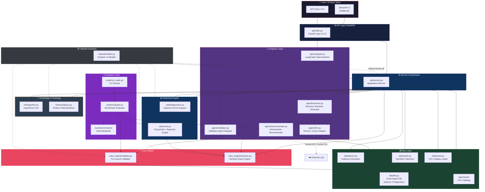
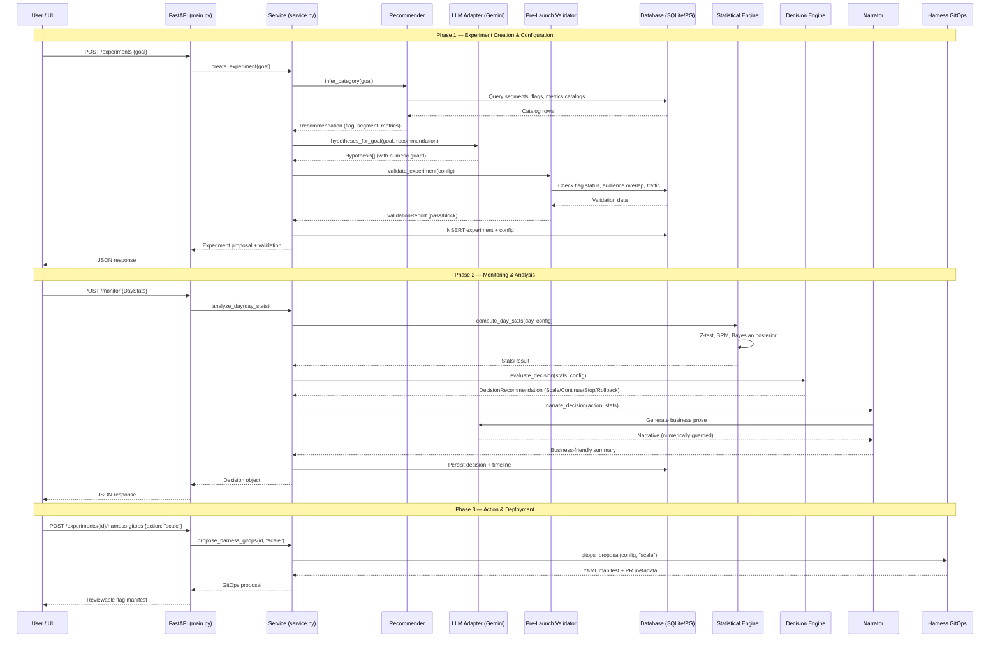
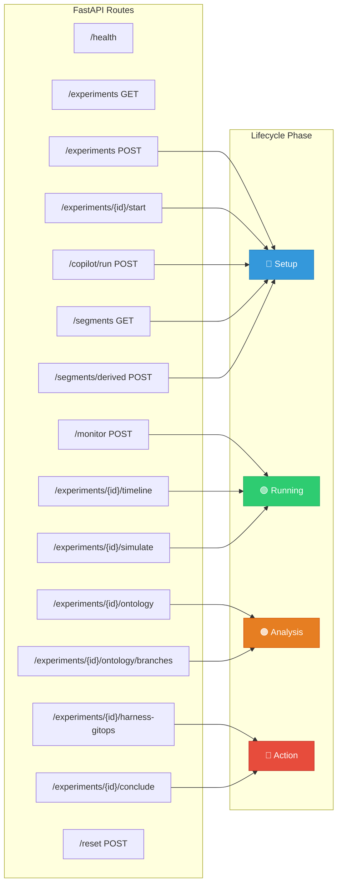
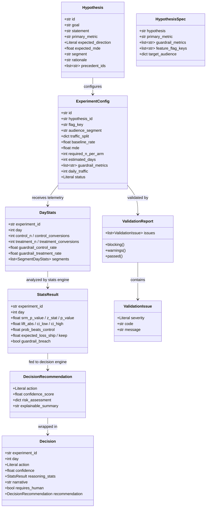
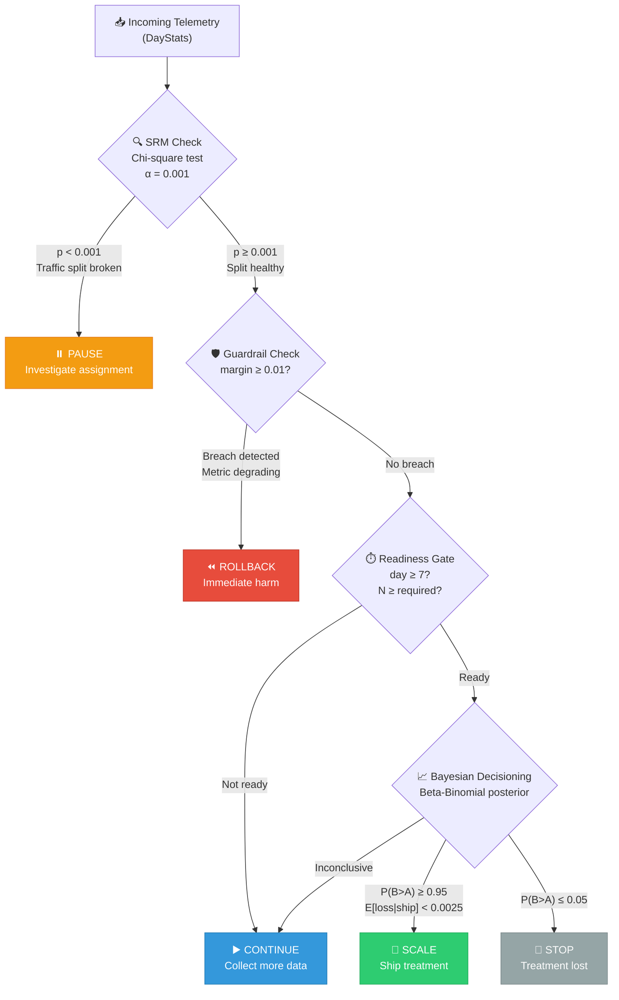
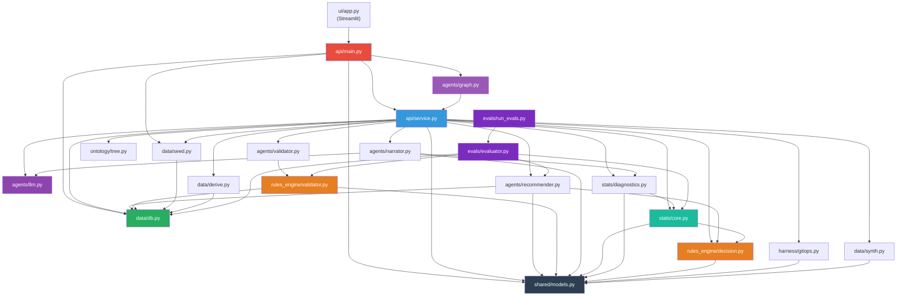

# ExpPilot — System Architecture

> **AI Experiment Copilot & Decision Intelligence**
> Full-lifecycle experimentation platform: hypothesis → configuration → monitoring → decision → deployment

---

## High-Level System Overview



---

## Experiment Lifecycle Flow



---

## API Endpoints Map



---

## Data Model & Pydantic Contracts



---

## Statistical & Decision Engine Pipeline



---

## Data Layer & Catalog Schema

```mermaid
erDiagram
    SEGMENTS {
        text segment_key PK
        text display_name
        int population
        int daily_traffic
        float baseline_conversion_rate
        text description
    }

    FEATURE_FLAGS {
        text flag_key PK
        text display_name
        text status
        text category
        text owner
    }

    METRICS_CATALOG {
        text metric_key PK
        text display_name
        text direction
        text category
        text unit
    }

    HISTORICAL_EXPERIMENTS {
        text experiment_id PK
        text category
        text segment_key
        text flag_key
        text primary_metric
        float lift
        text outcome
    }

    EXPERIMENTS {
        text id PK
        text config JSON
        text status
        text created_at
    }

    DECISIONS {
        text experiment_id FK
        int day
        text decision JSON
    }

    SEGMENTS ||--o{ HISTORICAL_EXPERIMENTS : "audience for"
    FEATURE_FLAGS ||--o{ HISTORICAL_EXPERIMENTS : "tested with"
    METRICS_CATALOG ||--o{ HISTORICAL_EXPERIMENTS : "measured by"
    EXPERIMENTS ||--o{ DECISIONS : "produces"
```

---

## Module Dependency Graph



---

## Technology Stack

| Layer | Technology | Purpose |
|-------|-----------|---------|
| **Frontend** | Streamlit (`ui/app.py`, 66KB) | Interactive dashboard & copilot UI |
| **API** | FastAPI v0.2.0 | REST endpoints, request validation |
| **Orchestration** | LangGraph (`agents/graph.py`) | State machine: configure → monitor → end |
| **AI / LLM** | Gemini Flash API + Cursor CLI fallback | Hypothesis prose & narrative generation |
| **Statistics** | SciPy + NumPy | Z-tests, Chi-square SRM, Beta-Binomial Bayes |
| **Data** | SQLite (local) / PostgreSQL (prod via Supabase) | Dual-engine transparent DB layer |
| **Catalogs** | CSV seed files (4 catalogs) | Feature flags, segments, metrics, history |
| **Deployment** | Docker + Railway | Containerized deployment |
| **Evals** | Custom benchmark suite | 20 gold + 30 telemetry scenarios |
| **Models** | Pydantic v2 | Typed contracts shared across all modules |

---

## File Tree Summary

```
ExpPilot/
├── api/
│   ├── main.py              # FastAPI app, 15 routes
│   └── service.py           # Central orchestrator (569 lines)
├── agents/
│   ├── graph.py             # LangGraph state machine
│   ├── llm.py               # Gemini/Cursor LLM adapter
│   ├── recommender.py       # Deterministic recommendation engine
│   ├── narrator.py          # Business narrative with numeric guard
│   └── validator.py         # Validation agent wrapper
├── rules_engine/
│   ├── validator.py          # 6 pre-launch validation checks
│   └── decision.py           # Scale/Continue/Stop/Rollback/Pause rules
├── stats/
│   ├── core.py               # Frequentist + Bayesian statistical engine
│   └── diagnostics.py        # Segment-level driver analysis
├── shared/
│   └── models.py             # 12 Pydantic v2 models + constants
├── data/
│   ├── db.py                 # Dual SQLite/PostgreSQL engine
│   ├── seed.py               # CSV → DB catalog loader
│   ├── derive.py             # Transaction log → audience segments
│   ├── synth.py              # Synthetic telemetry generator
│   └── seeds/                # 4 CSV catalog files
├── ontology/
│   └── tree.py               # Hypothesis tree (branch/invalidate)
├── harness/
│   └── gitops.py             # Harness feature flag YAML manifests
├── evals/
│   ├── evaluator.py          # Benchmark evaluator (6 metric families)
│   ├── run_evals.py          # CLI runner (text + JSON output)
│   └── benchmarks/           # 20 gold + 30 telemetry scenarios
├── ui/
│   └── app.py                # Streamlit dashboard (66KB)
├── distributed/              # Microservices scaffolding (future)
│   ├── decision_service/
│   ├── eventbus/
│   ├── gateway/
│   ├── tracing/
│   └── vector/
└── tests/                    # 50+ unit & integration tests
```
